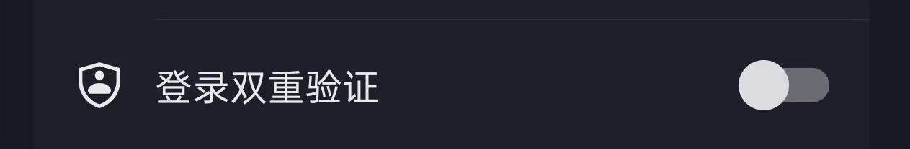

<div align="center">

# zhin-adapter-douyin

抖音桌面 IM 适配器

基于 [douyin.ts](https://www.npmjs.com/package/douyin.ts) SDK，支持抖音私聊 / 群聊消息收发与事件处理

</div>

## 🐬 安装教程

需要先准备基于 [Zhin.js](https://zhin.js.org) 的宿主应用

#### 🔧 宿主应用根目录执行命令安装

```bash
pnpm add zhin-adapter-douyin
```

推荐用 Zhin CLI 安装/卸载——自动写入或移除 `package.json#zhin.plugins` 清单（`install` 支持 `--dry-run` 预览改动、`--no-enable` 只装依赖不写配置）：

```bash
npx zhin install zhin-adapter-douyin          # 安装 + 自动写入清单
npx zhin uninstall plugin zhin-adapter-douyin --remove-pkg   # 卸载 + 移除清单与依赖
```

也可以手动挂载进宿主应用的 `package.json#zhin.plugins` 清单：

```json
{
  "zhin": {
    "plugins": [
      { "package": "zhin-adapter-douyin", "instanceKey": "douyin" }
    ]
  }
}
```

## 使用教程

- `#抖音登录` 扫码登录新账号（多账号时 `#抖音登录 <id>` 选中账号；触发短信/密码二次验证时，直接回复验证码或密码即可）
- `#抖音验证 <验证码>` 提交扫码登录的二步验证（需先发送 `#抖音登录` 触发）

启动时若本地已有会话会自动恢复，无会话时发送 `#抖音登录` 手动弹码。

## 配置说明

宿主 `zhin.config.yml` 顶层 `plugin:` 段（本包为根插件，`instanceKey` 即实例键）：

```yaml
plugin:
  endpoints:
    - id: douyin                # 账号实例标识（必填，#抖音登录 选中、日志前缀用）
```

| 字段 | 说明 |
| --- | --- |
| `id` | 账号实例标识（必填），用于 `#抖音登录 <id>` 选中账号 |
| `uid` | 抖音平台 uid（纯数字字符串）；提供时优先恢复本地会话 |
| `cookies` | 手动注入 cookie；未提供且本地无会话时走扫码登录 |
| `userAgent` | 本 endpoint 的 UA 覆盖 |

会话数据落盘在宿主应用的 `accountsDir`（默认 `<cwd>/data/douyin/accounts`）：`accounts.json` 按 uid 存储 cookie / 昵称 / 头像，登录自动写入、启动自动恢复。

## 账号安全与风控

### 登录双重验证（建议关闭）

抖音 App「设置 → 账号与安全 → 登录双重验证」开启后，新设备登录或异常登录会要求二次验证。机器人通过 Cookie 模拟登录，开启双重验证时容易触发风控拦截、登录后强制二次验证，导致掉线或消息收发异常。

**建议关闭双重验证**，保持 Cookie 登录稳定。



### 抖音风控限制

可能出现消息仅回显到自身、对方看不到。

## 消息支持

- 收：文本、@提及、图片、文件、引用回复、表情回应
- 发：文本、@、图片（base64/url/path）、文件、引用回复、表情回应
- 音频段自动降级为文本提示

## 事件支持

- message：私聊 / 群聊消息
- recall：消息撤回
- reaction：表情回应

## 其他框架集成

本插件面向 Zhin.js 运行时。若你希望在其他框架中使用抖音相关能力，可参考以下项目：

- [karin-plugin-adapter-douyin](https://github.com/dmmdekkd/karin-plugin-adapter-douyin)（Karin 框架）
- [DouYin-Plugin](https://github.com/dmmdekkd/DouYin-Plugin)（Yunzai 框架）

## 相关链接

- SDK：https://www.npmjs.com/package/douyin.ts
- Zhin.js：https://zhin.js.org
- GitHub：https://github.com/zhinjs/zhin
- 许可证：MIT